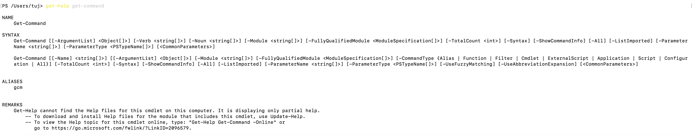

# 第一章: PowerCLI基础知识
***
VMware PowerCLI是一个基于Windows PowerShell的命令行和脚本工具，提供了超过700个cmdlet，用于管理和自动化vSphere、vCloud Director、vRealize Operations Manager、vSAN、NSX-T、VMware Cloud Services、AWS上的VMware Cloud、VMware HCX、VMware Site Recovery Manager、VMware Horizon环境。   

## 1. Powershell 基本语法
学习PowerCLI之前,我们先学习一下Powershell的基本语法.   

### 1.1 Get-Command 获取所有命令
Get-Command: 得到所有PowerShell命令，获取有关 cmdlet 以及有关 Windows PowerShell 命令的其他元素的基本信息。包括Cmdlet、Alias、Function。
**语法: Get-Command get-vmhost*** 表示获取Get-VMHost开头的所有命令以及有关这些命令的基本信息.

### 1.2 Get-Help 得到命令帮助
Get-Help: 显示有关 Windows PowerShell 命令和概念的信息
**语法: Get-Help Get-Command** 表示得到Get-Command命令的帮助说明


### 1.3 管道符 |
管道中的每个命令接收上一个命令运行的结果，并对这个结果执行一些操作，然后将它传递到管道中的下一个命令。对象一旦可用，即从管道输出。
**语法: Command-1 | Command-2 | Command-3**


### 1.4 通配符 *和?
PowerShell 具有许多名为通配符的模式匹配运算符，您可以使用这些运算符替换字符串中的一个或多个字符，或替换整个字符串。所有通配符表达式都可以与 PowerCLI cmdlet 一起使用。例如，您可以通过运行 dir *.txt 查看具有 .txt 扩展名的所有文件的列表。在这种情况下，星号 \* 运算符匹配字符的任意组合。使用通配符模式，也可以指示字符范围。例如，若要查看以字母 S 或 T 开头且具有 .txt 扩展名的所有文件，可以运行 dir _st_\*.txt。您可以使用问号？通配符以匹配字符序列中的任何单个字符。例如，若要查看所有 .txt 文件，其名称由字符串和末尾的一个字符组成，请运行 dir 字符串?.txt


## 2. PowerCLI 基本概念
PowerCLI cmdlet 是用来实现 VMware 环境的自动化管理，下面会介绍除了 PowerShell 概念之外的一些特定功能.

### 2.1 PowerCLI模块
VMware PowerCLI 12.0.0由多个模块组成，您可以根据需要来安装和使用PowerCLI。
下表列出了所有VMware官方发布的PowerCLI模块。
|模块|描述|
| -- | -- |
|VMware.PowerCLI|提供其他模块所依赖的根模块。此模块可确保如果需要，可以将 PowerCLI 产品作为完整封装进行安装、升级和拆卸。|
|VMware.VimAutomation.Core |提供用于自动管理 vSphere 环境的 cmdlet.|
|VMware.VimAutomation.Common |提供所有PowerCLI模块通用的功能。这个模块没有cmdlet，但是其他模块要正常工作，它是必需的。|
|VMware.VimAutomation.Sdk |提供所有PowerCLI模块所需的SDK功能。这个模块没有cmdlet，但是其他模块要正常工作，它是必需的。|
|VMware.VimAutomation.Vds|提供用于管理 vSphere 分布式交换机和分布式端口组功能的cmdlet 。|
|Vmware.VimAutomation.Cis.Core|提供用于管理 vSphere 自动化 Sdk 服务器的cmdlet。|
|VMware.VimAutomation.Storage |提供用于管理 vSAN 和 vSphere 基于策略的存储的 cmdlet。|
|VMware.VimAutomation.StorageUtility |为存储提供实用程序脚本。|
|VMware.VimAutomation.License|提供Get-LicenseDataManager cmdlet来管理 VMware 许可证组件。|
|VMware.ImageBuilder |提供用于管理站点、映像配置文件和 VIB的cmdlet.|
|VMware.DeployAutomation |提供cmdlet来提供一个接口，给VMware自动部署配置主机和ESXi软件。|
|Vmware.VimAutomation.Cloud |提供用于自动化 vCloud Director功能的 cmdlet。|
|VMware.VumAutomation |提供用于自动化 vSphere 更新管理器功能的 cmdlet.|
|VMware.VimAutomation.vROps |提供用于自动化 vRops功能的 cmdlet.|
|VMware.VimAutomation.Srm |提供用于管理 VMware Site Recovery Manager功能的cmdlet。|
|Vmware.VimAutomation.HorizonView |提供用于自动化 Vmware Horizon 功能的 cmdlet。|
|VMware.VimAutomation.nsxt |提供用于管理Nsx-T服务器的cmdlet。|
|VMware.VimAutomation.Vmc|提供用于自动化管理V Mware Cloud on AWS的cmdlet。|
|VMware.Vim| 提供包含 vSphere 低级绑定库的模块。|
|VMware.VimAutomation.Security |提供用于管理 vSphere 安全性的 cmdlet，包括用于管理 VMware HCX 功能的虚拟可信平台模块.|
|VMware.VimAutomation.Hcx |提供用于管理 VMware HCX功能的cmdlet.|
|VMware.VimAutoment.WorkLoadManagement|提供用于管理太平洋项目的cmdlet.|
|VMware.CloudServices |提供用于管理 VMware 云服务的cmdlet.|


### 2.2 在PowerCLI里面选择对象
在PowerCLI中，可以将字符串和通配符传递给以inventory对象、数据存储、OSCustomizationSpec对象和VIServer对象作为参数的所有参数。这种PowerCLI方法被命名为“按名称对象”(OBN)选择。
用户可以通过管道或变量传递对象，而不是将对象名称分配给cmdlet参数。例如，以下三个命令是可互换的:
* Remove-VM -VM "Win 7 SP1"
* Get-VM -Name "Win 7 SP1" | Remove-VM
* Remove-VM -VM (Get-VM -Name "Win 7 SP1")
**注意**: 在PowerCLI中，不支持将字符串作为管道输入传递。  
  
**例子**: 一个 "OBN Failure".  
```  
    Set-VM -VM "VM1", "VM2", "VM3" -Server $server1, $server2 -MemoryGB 2
```  
如果指定的VM2虚拟机上不存在，则抛出一个不可终止的错误，并且命令仅在VM1和VM3虚拟机上执行。  
  
### 2.3 提供登录凭据
当您在命令提示符或脚本文件中提供登录凭据时，PowerShell的限制可能会阻止PowerCLI正确处理非字母数字字符。若要防止登录问题，请转义凭证中的非字母数字字符。
要对PowerCLI中的非字母数字字符进行转义，需要将包含这些字符的表达式放在单引号(')中。
***注意，在“指定凭据”对话框中提供登录凭据时，不需要转义非字母数字字符。***
**例子:连接vCenter**
这个示例演示了如何在使用Adminis!ra!or用户名和pa$$word密码连接到选定的vCenter服务器。   
  
```
Connect-VIServer -Server 10.23.112.235 -Protocol https -Username 'Adminis!ra!or' -Password 'pa$$word'
```  
  
### 2.4 异步运行PowerCLI cmdlet
默认情况下，PowerCLI cmdlet只在完成请求的任务后返回输出。如果您希望cmdlet立即返回到命令行，而不等待任务完成，那么可以使用RunAsync参数。
当使用RunAsync参数时，cmdlet返回任务对象，而不是通常的输出。返回的任务对象的状态属性包含任务初始状态的快照。此状态不会自动更新，其值为Error、Queued、Running或Success。通过使用Get-Task cmdlet检索任务对象，可以刷新任务状态。如果您想观察正在运行的任务的进度，并在运行其他命令之前等待任务完成，请使用等待任务cmdlet。  
**注意:**  
在PowerCLI中，RunAsync参数仅影响cmdlet的调用，并且不控制启动的任务是连续运行还是并行运行。 例如，取决于PowerCLI的内部设计，Remove-VM cmdlet可能会同时或连续删除选定的虚拟机。 若要确保由cmdlet发起的任务连续运行，请在每次将cmdlet应用于单个对象时都循环运行该cmdlet。  

####示例使用和不使用RunAsync参数运行Remove-VM
```
Remove-VM $vmList
```  
删除$vmList变量中存储的所有虚拟机时，无论是否同时删除它们，该命令都不会返回任何输出。
```
Remove-VM $vmList -RunAsync
```   
该命令立即返回由一个或多个Task对象组成的输出。   

### 2.5 管理默认服务器连接
默认情况下，如果无法通过提供的参数确定目标服务器，则PowerCLI和PowerCLI cmdlet在您连接到的vCenter Server系统或vCloud Director服务器上运行。
使用Connect-VIServer连接到vCenter Server系统时，服务器连接存储在\$DefaultVIServers数组变量中。此变量包含当前PowerCLI会话的所有连接的服务器。要从\$DefaultVIServers变量中删除服务器，可以使用Disconnect-VIServer关闭与此服务器的所有活动连接，也可以手动修改\$DefaultVIServers的值。
使用Connect-CIServer连接到vCloud Director系统时，服务器连接存储在\$ DefaultCIServers数组变量中。此变量包含当前会话的所有连接的服务器。要从\$ DefaultCIServers变量中删除服务器，可以使用DisconnectCIServer关闭与此服务器的所有活动连接，也可以手动修改$DefaultCIServers的值。
   
### 2.6 PowerCLI中的自定义规范对象
PowerCLI提供两种类型的对象用于自定义规范：持久对象和非持久对象。
####持久定制
持久性自定义规范对象存储在vSphere服务器上。 使用vSphere Client或VMware PowerCLI 4.1或更高版本创建的所有持久性自定义规范均已加密。 加密的自定义规范只能由已对其进行加密的服务器应用。
####非持久定制
非持久性自定义规范对象仅在当前PowerShell进程内部存在。 非持久性自定义规范对象未加密，但将其克隆到vSphere服务器中将对其进行加密。
   
### 2.7 将ESXCLI与PowerCLI一起使用
PowerCLI使您能够通过其控制台使用ESXCLI。
PowerCLI提供了两种使用ESXCLI的方法：
* 通过Get-ESXCli cmdlet，可直接访问ESXCLI命名空间，应用程序和命令。
* 通过.NET方法，用于创建与特定ESXCLI应用程序相对应的托管对象。 要访问ESXCLI，可以在这些托管对象上调用方法。
> 注意：要调用ESXCLI对象的方法，必须为所有参数提供值。 如果要省略给定的参数，请传递$ null作为其参数。
  
### 2.8 PowerCLI的关于文章
您可以从名为about的内置帮助文章中了解有关PowerCLI概念和功能的更多信息。 您可以通过运行的PowerCLI进程访问它们。
运行help About_ *会列出有关文章的所有内置PowerShell和VMware PowerCLI。
|文章题目|命令|文章描述|
|--|--|--|
| Customer Experience Improvement Program (CEIP) | Help About_CEIP | 提供有关VMware的客户体验改善计划（“ CEIP”）的信息。|
| Handling Invalid Certificates | Help About_Invalid_Certificates | 连接到服务器时，VMware PowerCLI将检查服务器证书是否有效。如果该服务器不信任该证书，则默认情况下，VMware PowerCLI无法连接到该服务器。 |
| Object-by-Name (OBN) | Help About_OBN | 为了帮助您节省时间和精力，PowerCLI允许您按对象名称选择对象。|
| VMware PowerCLI Objects | Help About_PowerCLI_Objects | 对于它们的输入和输出，PowerCLI cmdlet使用驻留在VMware.VimAutomation.ViCore.Types命名空间中的一组.NET类型。|
| Using the RunAsync Parameter | Help About_RunAsync | 设置RunAsync参数时，表示要异步运行cmdlet。|
| Authenticating with a vCenter Server System or a vCloud Server | Help About_Server_Authentication | 要使用vCenter Server和vCloud Director服务器进行身份验证，可以通过User和Password参数提供用户名和密码，或者通过Credential参数提供PSCredential对象。|
| Unique Identifiers for PowerCLI Objects (UID) |Help About_UID  | 您可以通过提供一个UID来唯一标识一个服务器上或多个服务器上的PowerCLI对象。|
| Datastore Provider (VimDatastore)  | Help About_VimDatastore | 数据存储提供程序（VimDatastore）提供文件系统样式的视图，并提供对数据存储内容的访问。|
|LicenseDataManager  | Help About_LicenseDataManager | LicenseDataManager组件使您可以使用许可证数据扩展vCenter Server清单。|


## 3. 安装PowerCLI
通过VMware PowerCLI，您可以通过命令行在vCenter Server，vRealize Operations Manager，vSphere Automation SDK，vSAN，vCloud Director，vSphere Update Manager，NSX-T和VMware Cloud上管理，监视，自动化和处理生命周期操作。 您可以在所有受支持的操作系统上安装VMware PowerCLI模块。
在计算机上安装软件包之后，可以通过提供有效的身份验证凭据来连接到vCenter Server，vRealize Operations Manager，vSphere Automation SDK，vCloud Director或vSphere Update Manager系统。

### 3.0 安装前提条件
#### 支持的操作系统
您可以在受支持的操作系统上安装PowerCLI。您可以对安装了受支持的来宾操作系统的虚拟机运行来宾cmdlet。
#### PowerCLI本地操作系统
有关可以在其上安装VMware PowerCLI 12.0.0的操作系统的列表，请参阅[《 VMware PowerCLI 12.0.0的兼容性列表》](https://code.vmware.com/web/tool/12.0.0/vmware-powercli)。
##### PowerCLI客户机操作系统
您可以对具有受支持的来宾操作系统的虚拟机运行VMware PowerCLI 12.0.0来宾cmdlet。有关受支持的操作系统的列表，请参阅[《 VMware PowerCLI 12.0.0的兼容性列表》](https://code.vmware.com/web/tool/12.0.0/vmware-powercli)。
> 注意Guest cmdlet与IPv6环境不兼容。

#### 支持的VMware产品
您可以使用PowerCLI模块来管理所有受支持的VMware产品。
有关与VMware PowerCLI 12.0.0兼容的VMware产品的列表，请参见[VMware产品互操作性矩阵](https://www.vmware.com/resources/compatibility/sim/interop_matrix.php#interop&299=4093)。
#### 支持的PowerShell版本
PowerCLI与PowerShell的多个版本兼容。
有关与VMware PowerCLI 12.0.0兼容的PowerShell版本的列表，请参阅[《 VMware PowerCLI 12.0.0的兼容性列表》](https://code.vmware.com/web/tool/12.0.0/vmware-powercli)。
#### 安装和运行PowerCLI的先决条件
在安装和运行PowerCLI之前，请确认您已在同一台计算机上安装了所需的软件。
有关要使用VMware PowerCLI 12.0.0所需的软件的列表，请参阅[《 VMware PowerCLI 12.0.0的兼容性列表》](https://code.vmware.com/web/tool/12.0.0/vmware-powercli)。


### 3.1 在线安装
#### 3.1.1 在线安装
打开Powershell(Windows直接打开Powershell终端,Linux和Mac OS需要先安装Powershell,然后在终端中输入pwsh,),然后输入如下命令:  

```
Install-Module VMware.PowerCLI
```
按照提示操作就能安装成功.


### 3.2 离线安装
实际上就是将PowerCLI的模块压缩包解压到Powershell的Modules文件夹下面;   
#### 3.2.1 Windows下powershell 的Modules文件夹可能存在的位置为:   
```
C:\Program Files\WindowsPowerShell\Modules     (需要管理员权限并且所有用户生效)
或者
%UserProfile%\Documents\WindowsPowerShell\Modules   (仅当前用户生效)
```

#### 3.2.2 Linux下
将下载的PowerCLI模块包解压到系统的如下位置:   
``` 
# MAC OS 和Linux OS一样
/usr/local/microsoft/powershell/7/Modules       (所有用户生效)
/<current user>/.local/share/powershell/Modules     (仅当前用户生效)

```

## 4. PowerCLI配置更新卸载
### 4.1 设置Powershell的执行策略为不受限制
如果Powershell是运行在windows 平台上,则需要运行如下命令来设置PS脚本执行策略.(Mac 和Linux OS不需要此操作)   
```
Set-ExecutionPolicy unrestricted  #全局设置
或者
Set-ExecutionPolicy -Scope CurrentUser unrestricted  #仅当前用户
或者
Set-ExecutionPolicy RemoteSigned  #全局设置
```

### 4.2 消除证书错误以及验证安装是否成功
在打开的powershell中输入如下命令来消除证书的错误;当然更安全的办法是让powershell信任vcenter或者Esxi的证书,但是实际情况是,由于信任证书操作需要额外的时间,我们一般忽略这个错误直接连接vCenter或者Esxi开始工作.(如果有人对信任证书有兴趣)
```
Set-PowerCLIConfiguration -InvalidCertificateAction Ignore
```
这条命令如果可以执行成功,则表示powercli以及安装成功,下面就可以正常使用了.


### 4.3 更新PowerCLI模块
当模块的新版本可用时，您可以更新PowerCLI模块。
如果使用Update-Module，则不会删除该模块的现有版本。 要更新模块，应首先卸载模块的现有版本，然后再安装新版本。
程序
1. 打开PowerShell控制台。
2. 卸载模块的现有版本。
```
Get-Module VMware.Module_Name | Uninstall-Module -Force
```  
3. 安装新版本的模块。 
```
Install-Module VMware.Module_Name
```

### 4.4 卸载PowerCLI
您可以通过运行PowerShell命令来卸载PowerCLI。 您可以卸载所有正式模块，也可以分别卸载模块。
####先决条件
n确认您已关闭所有正在运行PowerCLI模块的PowerShell会话。
####步骤
1. 打开PowerShell控制台。
2. 要卸载除VMware.PowerCLI以外的所有正式PowerCLI模块，请运行以下命令。
```
(Get-Module VMware.PowerCLI -ListAvailable).RequiredModules | Uninstall-Module -Force
```
3. 运行如下命令来卸载PowerCLI主要模块.
```
Get-Module VMware.PowerCLI -ListAvailable | Uninstall-Module -Force
```