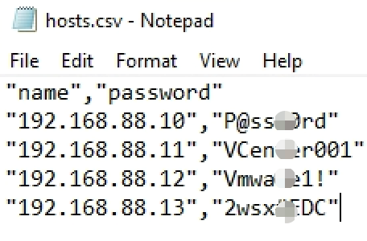
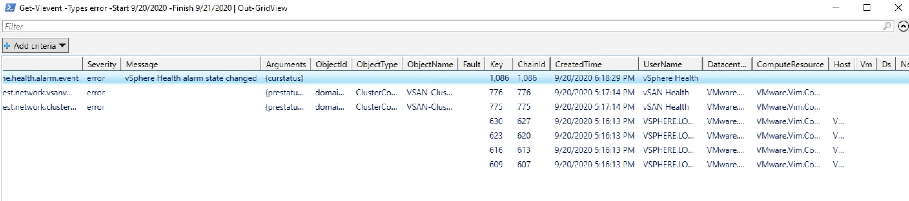

# 第二章: PowerCLI 配置vCenter 以及 vSphere集群
***

## 1. 连接vCenter
使用PowerCLI来管理vSphere环境,那第一步需要做的是将PowerCLI连接到vCenter;如下是通常情况下的使用方法;
```
Connect-VIServer -Server vCenter.example.com -User 'Administrator@vsphere.local' -Password 'MyPassword'
```   

如果用户环境使用了系统Proxy,我们也可以在PowerCLI中配置系统的Proxy;
```
Set-PowerCLIConfiguration -ProxyPolicy UseSystemProxy
```  
或者如果不用Proxy,则可以改回来
```   
Set-PowerCLIConfiguration -ProxyPolicy NoProxy
```   


## 2. 创建数据中心
创建名称为Beijing-DC的数据中心.
```   
$location = Get-Folder -NoRecursion
New-Datacenter -Location $location -Name Beijing-DC
```  
#### 参数说明:
* Get-Folder -NoRecursion 获取根目录
* -location -Name 是必须要使用的参数

## 3. 创建集群
在Beijing-DC中创建名字为Cluster001的集群.
```
New-Cluster –Name Cluster001 –Location “Beijing-DC”
```

在Beijing-DC数据中心中创建名称为ClusterA的集群,顺带把集群HA和DRS也开了
```
New-Cluster -Location (Get-Datacenter -Name "Beijing-DC") -Name ClusterA -HAEnabled -DRSEnabled -DRSAutomationLevel FullyAutomated
```   

## 4. 添加主机到集群中
查看vCenter Server中链接的所有主机;
```
Get-VMHost
```
### 方法一：添加主机
最简单的添加单台主机的办法，可以是主机名或者IP地址；
```
Add-VMHost -Name Host -Location (Get-Datacenter Beijing-DC) -User root -Password pass
```

### 方法二：基于ip地址范围添加
您还可以基于其IP地址范围添加主机。 由于要使用主机名而不是IP地址来管理vCenter中的主机，因此必须进行反向查找以获取DNS名称。 此代码段将10个IP地址范围为192.168.0.10-192.168.10.20的主机（其主机名）添加到vCenter中的Beijing-DC数据中心中。
```
10..20 | ForEach-Object { [System.Net.Dns]::GetHostbyAddress("192.168.0.$_")  } | 
select-object HostName | ForEach-Object { Add-VMHost $_.HostName -Location (Get-Datacenter -Name "Beijing-DC") -User root -Password <Password> -RunAsync -force:$true }
```
#### 参数说明:
* 10..20 PowerShell 中标书数组,包含从 10 到 20 的数字
* ForEach-Object 循环语句
* $_代表的是管道中的当前元素
* [System.Net.Dns]::GetHostbyAddress() 代表通过 ip 地址获取主机名
* -Force:$true 表示强制执行
* -RunAsync 表示同步运行多个任务

### 方法三：基于主机名番位添加主机
通过主机名范围将多个主机添加到vCenter，此解决方案需要一致的主机名。 该代码段将20个名为esx1.vlab.local-esx20.vlab.local的主机添加到vCenter中的Beijing-DC数据中心中。
```
1..20 | Foreach-Object { Add-VMHost esx$_.vlab.local -Location (Get-Datacenter Beijing-DC) -User root -Password <Password> -RunAsync -force:$true}
```

### 方法四：通过输入文本文件将多个主机添加到vCenter
您可以使用文本文件将多个ESX主机添加到vCenter中。 如果您没有一致的IP地址或主机名，这可能会很有用。 只需创建一个文本文件，每行一个主机即可：

```
Get-Content hosts.txt | Foreach-Object { Add-VMHost $_ -Location (Get-Datacenter -Name "Beijing-DC") -User root -Password <Password> -RunAsync -force:$true}
```

#### 参数说明:
* Get-Content 表示获取文本文件的内容

### 方法五：使用CSV文件将多个主机添加到vCenter
您还可以使用CSV文件将多个ESX主机添加到vCenter中。 这可以帮助您进一步指定添加ESXi主机（常见使用场景，使用不同密码的ESXi主机）：

```
Import-Csv hosts.csv | Foreach-Object { Add-VMHost $_.name -Location (Get-Datacenter Beijing-DC) -User root -Password $_.password -RunAsync -force:$true}
```
#### 参数说明:
* Import-Csv 导入 CSV 文件的内容

## 5. 配置集群
为了设置群集的高级功能（包括HA，DRS和EVC），即配置群集的高可用和动态资源平衡功能，请执行以下步骤：
### 5.1 Set-Cluster 开启HA,DRS,VSAN功能
对任何现有群集的更改将使用Set-Cluster cmdlet。 Set-Cluster cmdlet和New-Cluster cmdlet有相同的功能。使用**Set-Cluster**，您将使用-Cluster 参数指定集群，然后可以对所需的集群进行任何配置更改。让我们快速开始,先禁用HA：
```
Set-Cluster -Cluster “ClusterA” -HAEnable $false
```
将\$false更改为$true，则为启用HA功能。
```
Set-Cluster -Cluster “ClusterB” -HAEnable $true
```
```
Get-Cluster -Name ClusterA | Set-Cluster -HAEnabled:$false  -DRSEnabled:$false -vSANEnabled:$false
```
或者不使用管道符,直接操作
```
Set-Cluster -Cluster ClusterA -HAEnabled:$true -DrsEnabled:$true -VsanEnabled:$false
```

#### 参数说明:
* -HAEnabled:$false 表示不启用 HA
* -DRSEnabled:$false 表示不启用 DRS
* -vSANEnabled:$false 表示不启用 vSAN

### 5.2 设置HA的高级功能AdmissionControl,HAFailoverLevel
接下来，您可能想要更改群集上HA的AdmissionControl和故障转移级别设置。同样，您转到Set-Cluster cmdlet进行这些设置的更改。 -HAAdmissionControlEnabled参数控制是否打开“准入控制”。 -HAFailoverLevel参数设置为1到4之间的数字，指定您希望集群能够承受多少主机故障。
```
Set-Cluster -Cluster “ClusterA” -HAadmissionControlEnabled $true -HAFailoverLevel 1
```

### 5.3 设置HA高级功能IsolationResponse,RestartPriority
接下来，您可以再次使用Set-Cluster cmdlet来为群集设置IsolationResponse和RestartPriority设置。首先，如果主机变为隔离状态，则使用-HAIsolationResponse设置行为。接下来，使用-HARestartPriority设置默认优先级以重启集群中的VM：
```
Set-Cluster “ClusterA” -HAIsolationResponse shutdown -HaRestartPriority 2
```
还需要注意的是，所有这些设置都可以组合在一个Set-Cluster cmdlet中。
#### 参数说明:
* -HaRestartPriority 可以是数字 1,2,3 或者也可以写成 High,Medium,Low; 1 代表 High,2 代表 Medium, 3 代表 Low

### 5.4 设置集群DrsAutomationLevel
它也通常在群集上更改DRS模式。Todothis，您可以再次使用Set-Cluster cmdlet，但是您将使用-DrsAutomationLevel参数设置模式：
```
Set-Cluster -Cluster “ClusterA” -DrsAutomationLevel Manual -Confirm：$false
```

更常见的是，您可能希望将DRS模式设置为全自动：
```
Set-Cluster -Cluster “ClusterA” -DrsAutomationLevel FullyAutomated -Confirm:$false
``` 

### 5.5 设置集群亲和规则
接下来，在此示例中，您将通过定义DRS规则来确保我们的域控制器不在同一ESXi节点上运行。首先，您需要检索一个Get-VM cmdlet的域控制器VM的列表。 New-DrsRule cmdlet允许您创建KeepTogether或Separate规则。语法非常简单。您需要为我们的规则指定一个名称，一个集群，无论这是否是KeepTogether规则，最后要指定一个变量传递哪些VM：
```
$domaincontrollers = Get-VM -Name “DC*”
New-DrsRule -Name “Single DC” -Cluster “ClusterA” -enable $true -KeepTogether $false -VM $domaincontrollers
```

### 5.6 启动集群EVC
从PowerCLI直接报告EVC模​​式设置。首先，必须检索群集对象和EVC模式设置作为该对象的参数：
```
Get-Cluster “ClusterA” |Select Name，EVCMode
```

使用Set-Cluster cmdlet更改EVC模式设置非常简单.
```
Set-Cluster -Cluster “ClusterB” -EVCMode 'intel-ivybridge'
```

## 6. 删除集群
```
Get-Cluster -Name "ClusterA" | Remove-Cluster  –Confirm:$False

```
或者也可以不使用管道符,直接操作
```
Remove-Cluster -Cluster ClusterA –Confirm:$False
```

## 7. 配置 vCenter Server 的 SMTP
* 获取vCenter Server SMTP配置 
```
$srv=<vcenter server>
Get-AdvancedSetting -Entity  $srv -Name '*smtp*'
```

* 设置 SMTP 服务器以及端口
```
Get-AdvancedSetting –Entity $srv –Name mail.smtp.server | Set-AdvancedSetting –Value smtp.example.com
Get-AdvancedSetting –Entity $srv –Name mail.smtp.port | Set-AdvancedSetting –Value 25
```

## 8. 配置 vCenter Server 的 SNMP
* 获取 vCenter Server 的 SNMP 配置
```
Get-AdvancedSetting –Entity $srv –Name snmp.*
```

* 配置 SNMP 相关参数来收发数据
```
Get-AdvancedSetting –Entity $srv –Name snmp.receiver.2.community | Set-AdvancedSetting –Value public
Get-AdvancedSetting –Entity $srv –Name snmp.receiver.2.enabled | Set-AdvancedSetting –Value $true Get-AdvancedSetting –Entity $srv –Name snmp.receiver.2.name | Set-AdvancedSetting –Value xx.xx.xx.xx
```

## 9. vCenter Server 的事件日志管理
* 获取 vCenter Server 的事件日志
```
Get-VIevent
```

* 获取 vCenter Server 的事件日志并指定事件类型以及获取数量
```
Get-VIevent –Types error –Maxsamples 10
```

* 获取 vCenter Server 的事件日志并指定开始事件和结束时间
```
Get-VIevent –Start 9/22/2020 –Finish 9/23/2020
```

* 获取筛选的 vCenter Server 的事件日志并将结果发送到交互式窗口中
```
Get-VIevent –Types error –Start 9/22/2020 –Finish 9/23/2020 | Out-Gridview
```
#### 参数说明:
Out-Gridview 将结果发送到单独的交互式窗口中


* 获取筛选的 vCenter Server 的事件日志并将结果导出为 csv 文件
```
Get-VIevent -Types error -Start 9/20/2020 -Finish 9/21/2020 | ConvertTo-Csv | Out-File vievent.csv
```
#### 参数说明:
* ConvertTo-Csv 将结果保存为 csv 格式
* Out-File 为导出数据指定路径和文件名

# 本章结语:
本章我们学习了如何用 PowerCLI 来管理集群以及 vCenter; 在VMware环境主机数量比较大的情况下,PowerCLI 方便了集群的管理,可以很快的进行集群配置,批量添加主机等操作,减少了运维操作所花的时间.
当然除此之外,还能对 vCenter 以及集群进行更多细致化得操作,如果想要了解更多可以关注本公众号给本号留言.谈谈您想了解的方向.
